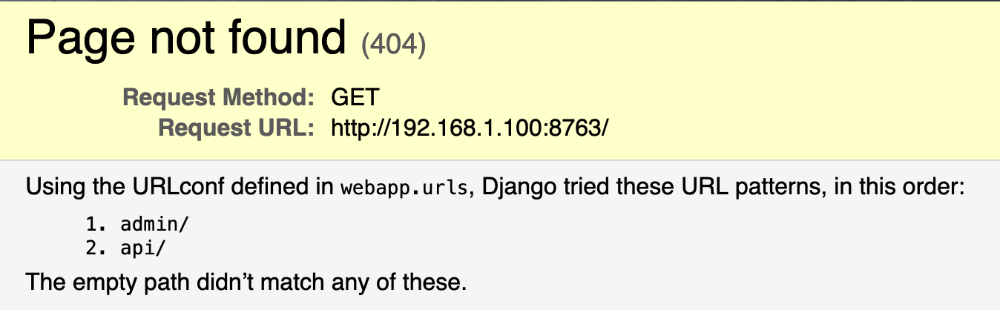
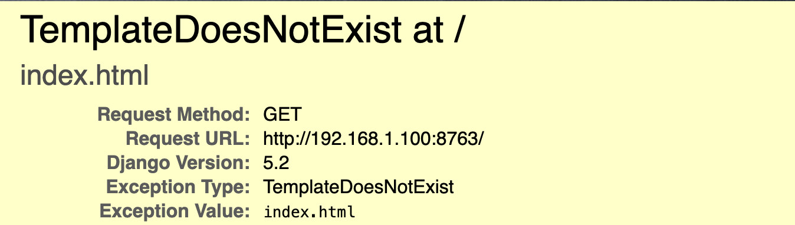

## Hello world!

It is now time to say "Hello World" from your Django application!

### 404!

Let's start the dev server and see how it looks at the beginning:

```bash
python manage.py runserver localhost:8763
Watching for file changes with StatReloader
Performing system checks...

System check identified no issues (0 silenced).
May 12, 2025 - 10:58:49
Django version 5.2, using settings 'webapp.settings'
Starting development server at http://localhost:8763/
Quit the server with CONTROL-C.

WARNING: This is a development server. Do not use it in a production setting. Use a production WSGI or ASGI server instead.
For more information on production servers see: https://docs.djangoproject.com/en/5.2/howto/deployment/
```

Point your browser to http://localhost:8763/, and you will immediately see a 404 HTTP Error:



This is because, while defaults are defined in urls.py, the call to `/` currently points nowhere. It is dispatched first by `webapp/webapp/urls.py` and redirected (or included) to the module-specific configuration:

```python
urlpatterns = [
    path('admin/', admin.site.urls),
    path('', include('web.urls')),
    path('api/', include('api.urls')),
]
```

However, `webapp/web/urls.py` has no paths defined, as we left it empty at the beginning:

```python
urlpatterns = []
```

Let's fix this and set up our "hello world" page.

### Add first path and first function view

In the `urlpatterns` list add a new entry, and specify:
 - `''` - an empty string, to match the base path. Remember that this path concatenates with the path from the including `urls.py`. In this case, since the `include` call also uses an empty string, two empty strings are concatenated. 
 - `views.index` - to use that view function to handle this request
 - `name='index'` - to give it a name we will use later to refer to it (eg.: when creating links)

Also, import necessary libraries:
 - `path` - to handle your URL request
 - `web.views` to import your views

```python
from django.urls import path
from web.views import index

urlpatterns = [
  path('', index, name='index'),
]
```

Now, we need to write the `index` function in `views.py`.

+Import the `HttpResponse` class from `django.http`, which is used to return content to the client. Write the function itself in `webapp/web/views.py`:

```python
from django.http import HttpResponse

def index(request):
    return HttpResponse("Hello from django!")

```

Function views use the ``request argument to handle data from the HTTP request and return an `HttpResponse`. As a programmer, you are only responsible for providing the content; Django handles the rest. In this example, the function returns text, which results in "Hello from django!" being displayed in your browser.


### Spinning up with templates

If you are wondering how to return your results, as it cannot be done like in the example above, you are absolutely right!

To complete this "Hello World" chapter, we need to discuss [templates](https://docs.djangoproject.com/en/5.2/topics/templates/) and their usage (in a simplified way). This is a critical part of Django that anyone building an app needs to understand well.


First of all, you can still use `HttpResponse` and its related classes because they provide a convenient shortcut to achieve your goal quickly, especially for raising errors. For instance, if your code performs some actions but cannot find an object to return, or if your application crashes and raises an exception. Instead of complex templating, you can (and often should) just raise a `404` or `500` error with your messages, using `HttpResponseNotFound("Not found")`, for example. The layout of the 404 page can also be customized using templates.

Secondly, to render content, we will use templates. Django has a good templating system, based on Jinja2. To use templates, they must, of course, be enabled in settings (they are by default), and you need to change the return function to `render()`.

What is the difference, you might ask? The major difference is that `HttpResponse` returns exactly what you pass as an argument, while `render()` uses the given template and context variables to compile them and return generated HTML to the client. This way, you abstract code generation elsewhere, and in the view, you focus on the logic and variables.

Let's rebuild our `index()` function:

```python
from django.shortcuts import render

def index(request):
    content = "Hello from django!"
    return render(request, 'index.html', context = {'content': content})
```

Modification concludes:
 - Importing the new shortcut function `render` ([read more](https://docs.djangoproject.com/en/5.2/topics/http/shortcuts/))
 - Defining a variable `content`, which holds our message.
 - Returning the result of the `render()` function, passing the `request` the template name `index.html`, and a `context` dictionary to hold the variables.

But, if you try to run it now, it will complain about missing template file, as it is not yet created.



To fix this, two things are needed:
 - add templates location to `settings.py`
 - add `index.html` itself

Before proceeding, I strongly recommend reading about template hierarchy and structure in the official Django documentation.

#### settings.py modifications

Add new variable, to keep project folder:

```python
PROJECT_DIR = Path(BASE_DIR).parent / "webapp" / "web"
```

and add the location of the `templates` folder within `PROJECT_DIR`:

```python
TEMPLATES = [
    {
        'BACKEND': 'django.template.backends.django.DjangoTemplates',
        'DIRS': [ Path(PROJECT_DIR / 'templates').resolve() ],
        'APP_DIRS': True,
        'OPTIONS': {
            'context_processors': [
                'django.template.context_processors.request',
                'django.contrib.auth.context_processors.auth',
                'django.contrib.messages.context_processors.messages',
            ],
        },
    },
]
```

Now create folder, and `index.html` template

```bash
mkdir webapp/web/templates
```


```html
<html>
  <head>
    <title>Hello world!</title>
  </head>
  <body>
    <h1>{{ content }}</h1>
  </body>
</html>

```

Now, after you refresh your browser, a welcome message will appear.

So, what happened here?

From the function `index()` I called `render()` function with template name and `context` variable, which passed the variable `content` to the template.

In the template, the engine found the `{{ content }}` variable and substituted it with the value of `context['content']` from the view function. And that's it!

Go ahead and experiment with it. I also recommend going through the Django documentation to understand more.

## Conclusion

`urls.py`  is where you define your URL paths and map them to the view functions that will handle the requests.

`views.py` is the file where you write most of your application logic; all view functions reside here.

`templates` is the directory where all template files are located. Remember the specific order in which Django searches for template files to parse.
